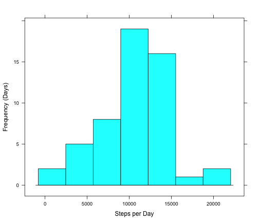
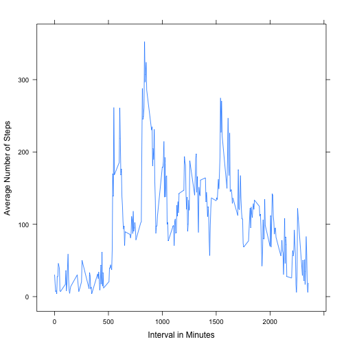
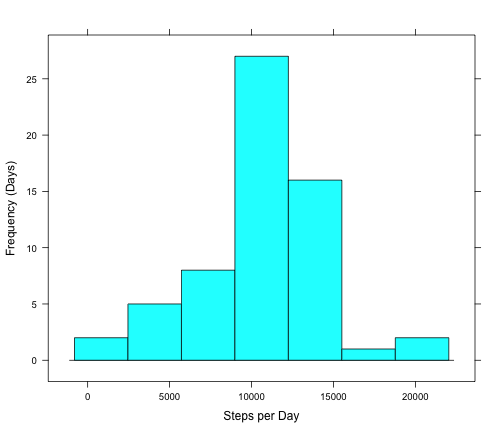
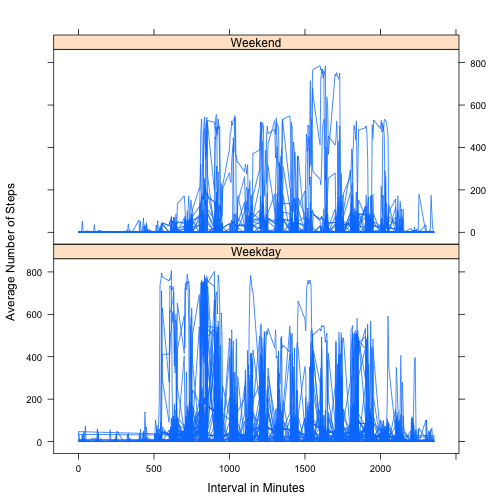

# Reproducible Research: Peer Assessment 1


## Loading and preprocessing the data


```r
setwd("~/Git/RepData_PeerAssessment1")
library(plyr)
fit_orig = read.csv("activity.csv")

fit1 = fit_orig[fit_orig$steps != 0 & !is.na(fit_orig$steps), ]
fit1$date = as.Date(fit1$date)

fit2 = ddply(fit1, "date", function(x) c(obs_count = nrow(x), tot_steps = sum(x$steps), 
    avg_steps = mean(x$steps), median_steps = median(x$steps)))
fit3 = ddply(fit1, "interval", function(x) c(avg_steps = mean(x$steps)))
```


## Histogram showing number of total steps per day (y-axis is number/frequency of days) 


```r
library(lattice)

histogram(fit2$tot_steps, type = "count", xlab = "Steps per Day", ylab = "Frequency (Days)")
```

 

```r

options(digits = 2)
avg_steps = as.character(round(mean(fit2$tot_steps), 2))
median_steps = as.character(median(fit2$tot_steps))
```


The Mean number of steps per day is 10766.19.
The Median number of steps per day is 10765.

## What is the average daily activity pattern?  Average Number of Steps Taken per 5-minute Interval


```r

xyplot(avg_steps ~ interval, type = "l", data = fit3, ylab = "Average Number of Steps", 
    xlab = "Interval in Minutes")
```

 


## Which interval on average has the daily maximum number of steps?

```r
maxint = fit3[fit3$avg_steps == max(fit3$avg_steps), ]
max_steps_interval = maxint$interval
max_avg_steps = maxint$avg_steps
```


Interval 835 has the maximum average number of steps of all intervals (352.48)

## Imputing missing values


```r
na_val_count = nrow(fit_orig[is.na(fit_orig$steps), ])
```

There are 2304 missing (NA) values in the original data set.

# Create a dataset that fills in the NA values with the mean for that day.

```r
fit4 = fit_orig
fit4$date = as.Date(fit4$date)

# Function that assigns all rows with steps = NA to average number of steps
# for that interval (ignore NA's)
fn = function(x) {
    if (is.na(x$steps)) 
        return(mean(fit_orig[fit_orig$interval == x$interval, ]$steps, na.rm = TRUE)) else return(x$steps)
}

fit4 = ddply(fit4, .(date, interval), .fun = fn)

names(fit4)[3] = "steps"

fit5 = ddply(fit4, "date", function(x) c(obs_count = nrow(x), tot_steps = sum(x$steps), 
    avg_steps = mean(x$steps), median_steps = median(x$steps)))
```


## After computation for missing values, Histogram showing number of total steps per day (y-axis is number/frequency of days) 


```r

histogram(fit5$tot_steps, type = "count", xlab = "Steps per Day", ylab = "Frequency (Days)")
```

 

```r

options(digits = 2)
avg_steps_narm = as.character(round(mean(fit5$tot_steps), 0))
median_steps_narm = as.character(round(median(fit5$tot_steps), 0))
```


The Mean number of steps per day after missing values for steps calculated is 10766.
The Median number of steps per day after missing values for steps calculated is 10766.

## What is the average daily activity pattern?  Average Number of Steps Taken per 5-minute Interval


```r

## Are there differences in activity patterns between weekdays and weekends?

fit6 = ddply(fit4, .(date, interval, steps), .fun = function(x) {
    if (weekdays(x$date) == "Saturday" | weekdays(x$date) == "Sunday") 
        return("Weekend") else return("Weekday")
})
names(fit6)[4] = "dayofweek"
fit6$dayofweek = as.factor(fit6$dayofweek)


xyplot(steps ~ interval | dayofweek, type = "l", data = fit6, ylab = "Average Number of Steps", 
    xlab = "Interval in Minutes", layout = c(1, 2))
```

 
